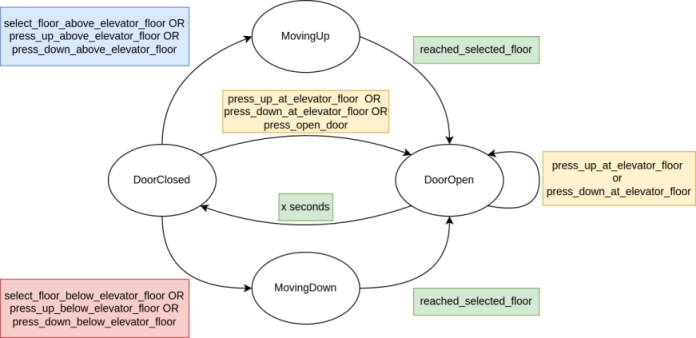

# Tiny State Machine

This is a tiny C++ template library to define state machines declaratively using event-based transitions. Given the lack of a standard C++ state machine library, I created this library as a simple and light-weight solution do define state machines in my projects. This is a header-only library, meaning that it can easily be copied into an existing project.

Note: This library was inspired by a similar solution developed by [tobyselway](https://github.com/tobyselway).

## Build

```bash
git clone git@github.com:dma-neves/tinysm.git
cd tinysm
mkdir build
cd build
cmake  ..
make
examples/elevator
```

## Usage

Tinysm conforms to the following model:

- The `State` type can be a primitive data type, an enum, etc. See example below.
- An `event` can trigger a transition between states. We define such events using a class that inherits from `event`. Inside the class we implement any logic we desire, and call the `trigger` method from the parent class to initiate a state transition. If no specific logic is required, we simply instantiate an `event` object, and call `trigger` whenever necessary.
- If multiple events should trigger the same state transition, we group them using an `event_group`. The `event_group` constructor receives a vector of `event` addresses.
- The `tsm` allows us to declaratively define the relation between state transitions and events or event groups. The `tsm` constructor receives a default state, and a map whose keys are tuples `<start_state, end_state>`, and values are events or event groups. If needed, it is also possible to dynamically add and remove transitions.
- The `tsm` constructor can optionally receive two additional parameters, an `enter_callbacks`and `exit_callbacks`. These allow us to describe callback functions to execute whenever a state is entered or exited. Both these parameters must be maps whose keys are a state, and value a `std::function<void(void)>`. See the [clock example](examples/clock.cpp).

## Elevator Example




```c++
#include "tinysm.hpp"

enum ElevatorState {
    MovingUp,
    MovingDown,
    DoorOpen,
    DoorClosed,
};

class close_door_timer : public event<ElevatorState> {
public:
    void update(int increment = 1) {
        seconds += increment;
        if(seconds >= threhsold) {
            reset();
            trigger();
        }
    }

    void reset() { seconds = 0; }
    
private:
    int seconds = 0;
    static constexpr int threhsold = 3;
};

class open_door : public event<ElevatorState> {
public:
    open_door(close_door_timer& dt) : close_door_timer_(dt) {}
    
    void trigger() {
        close_door_timer_.reset();
        event<ElevatorState>::trigger();
    }
}

int main() {

    close_door_timer close_door_timer_;

    open_door press_up_at_elevator_floor_(close_door_timer_);
    open_door press_down_at_elevator_floor_(close_door_timer_);
    open_door press_open_door_(close_door_timer_);

    event<ElevatorState> 
        press_up_above_elevator_floor_,
        press_up_below_elevator_floor_,
        press_down_above_elevator_floor_,
        press_down_below_elevator_floor_,
        select_floor_above_elevator_floor_,
        select_floor_below_elevator_floor_,
        reached_selected_floor_;

    event_group<ElevatorState> open_door_({&press_up_at_elevator_floor_, &press_down_at_elevator_floor_, &press_open_door_});
    event_group<ElevatorState> go_down_({&select_floor_below_elevator_floor_, &press_up_below_elevator_floor_, &press_down_below_elevator_floor_});
    event_group<ElevatorState> go_up_({&select_floor_above_elevator_floor_, &press_up_above_elevator_floor_, &press_down_above_elevator_floor_});

    tsm<ElevatorState> elevator_sm(ElevatorState::DoorClosed, 
        {
            {{ElevatorState::DoorOpen,      ElevatorState::DoorClosed}, close_door_timer_},
            {{ElevatorState::DoorClosed,    ElevatorState::DoorOpen},   open_door_},
            {{ElevatorState::DoorOpen,      ElevatorState::DoorOpen},   open_door_},
            {{ElevatorState::DoorClosed,    ElevatorState::MovingUp},   go_up_},
            {{ElevatorState::MovingUp,      ElevatorState::DoorOpen},   reached_selected_floor_},
            {{ElevatorState::DoorClosed,    ElevatorState::MovingDown}, go_down_},
            {{ElevatorState::MovingDown,    ElevatorState::DoorOpen},   reached_selected_floor_},
        });

    print_elevator_state(elevator_sm.get_state()); // DoorClosed

    press_up_at_elevator_floor_.trigger();
    print_elevator_state(elevator_sm.get_state()); // DoorOpen

    close_door_timer_.update(3); 
    print_elevator_state(elevator_sm.get_state()); // DoorClosed

    select_floor_above_elevator_floor_.trigger();
    print_elevator_state(elevator_sm.get_state()); // MovingUp

    reached_selected_floor_.trigger();
    print_elevator_state(elevator_sm.get_state()); // DoorOpen

    close_door_timer_.update(3);
    print_elevator_state(elevator_sm.get_state()); // DoorClosed

    press_down_below_elevator_floor_.trigger();
    print_elevator_state(elevator_sm.get_state()); // MovingDown
}

```